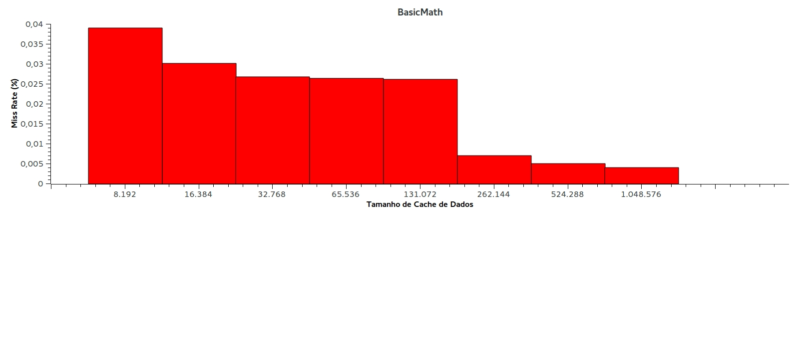
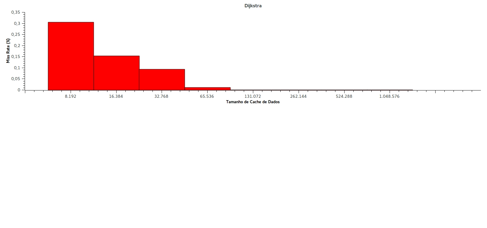
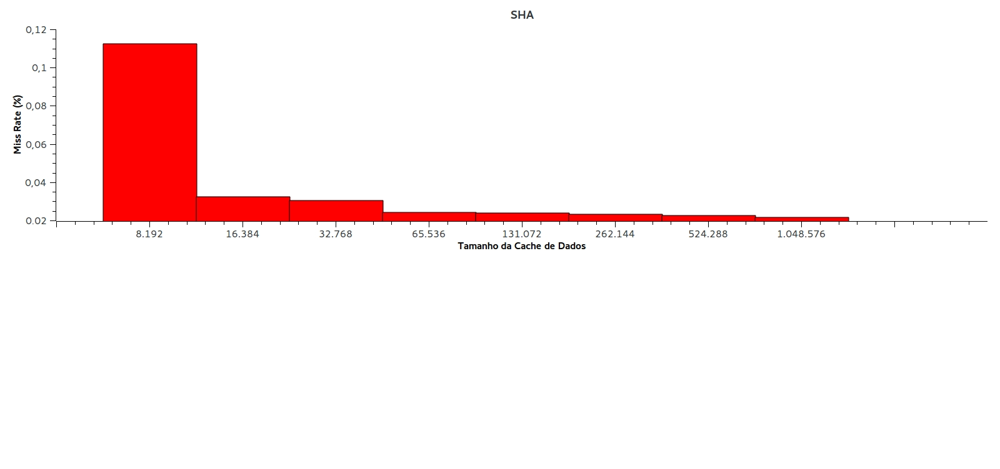

# MC733-Projeto2
Public repository for the second project

## 1. Introdução e Objetivo
Cada vez mais, são pesquisadas técnicas para aproveitar melhor o processamento de dispositivos computacionais, procurando realizar mais operações com maior qualidade e menos tempo. Algumas dessas descobertas foram memória cache, diferentes números de estágios no pipeline, superescalar e técnicas de branch predicition. Assim, o objetivo desse experimento é testar como obter melhores resultados de performance combinando as quatro técnicas acima.

## 2. Roteiro
Primeiramente, vamos escolher qual a melhor configuração da memória cache L1 unificada, semelhante ao que fizemos no exercício 2, a partir dos resultados com três programas. Escolhida essa configuração, vamos testar todas as combinações dos outros parâmetros que escolhemos:
tamanho de pipeline (5 e 7 estágios), processadores escalares e superescalares e técnicas de branch prediction. No caso do superescalar, vamos testar com duas instruções em paralelo. Assim, para cada combinação possível entre esses parâmetros, vamos analisar os resultados para os três programas. Os resultados finais serão mostrados no formato de gráficos e tabela. Faremos os testes com os programas 
**Dijkstra, basicmath e sha**.

## 3. Fundamentos Teóricos
Os tópicos abaixo descrevem como cada característica afeta o desempenho de uma arquitetura de hardware. Enquanto os quatro primeiros (configuração de cache, tamanho de pipeline, escalar vs superescalar, branch predictor) produzem efeitos sobre a execução de um programa, o último (hazard) é um efeito em si da manipulação de configurações do hardware (ou, em nosso caso, dos parâmetros da simulação).

### 3.1 Cache
- Associatividade: o desempenho tende a aumentar de acordo com o aumento de associatividade. No entanto, a taxa de misses tende a se estabilizar conforme esse número de vias aumenta. Além disso, o aumento de associatividade leva a um aumento no hit time.

- Tamanho dos blocos: quanto maior o tamanho dos blocos, melhor o desempenho, devido à localidade espacial. No entanto, o desempenho volta a diminuir a partir de determinado ponto, visto que haverá menos blocos, portanto maiores miss rates.

- Tamanho da cache (Quantidade de blocos): o aumento da quantidade de blocos tende a diminuir o miss rate em conformidade, porém aumenta o hit time.

### 3.2 Pipeline
O aumento da profundidade (ou quantidade de estágios) de um pipeline aumenta a quantidade de instruções sendo executadas simultaneamente.

### 3.3 Proc. Escalar e Superescalar
Processador superescalar é capaz de executar mais de uma instrução por ciclo, de modo que duas ou mais instruções estão presentes em cada estágio do pipeline. Esse tipo de processador usa o conceito de paralelismo para poder realizar todas as suas operações necessárias de maneira mais eficiente.

### 3.4 Branch Prediction
Branch Prediction é uma técnica usada em pipelines para que este não perca tanto tempo se recuperando de uma operação de branch, já que, caso exista uma instrução de branch no pipeline, todas as que estão antes dessa dentro do pipeline terão que ser descarregadas. Assim, fica fácil notar que seria muito mais eficiente somente colocar no pipeline instruções que realmente serão executadas.

### 3.5 Hazard
- Estrutural: acontece quando há competição por recurso. Exemplo: se há uma única memória (sem separação entre dados e instruções), o estágio de instruction fectch (IF) do pipeline pode ser _stalled_ durante uma instrução de load/store.

- Dados: se uma instrução depende de um dado ser atualizado em outro estágio do pipeline. Exemplo: duas instruções de adição em sequência no pipeline. O pipeline terá que ser _stalled_ por dois ciclos, caso não seja usado forwarding. Forwarding permite que uma informação seja disponibilizada com antecedência para outro estágio do pipeline.

- Controle: instruções de branch deslocam o fluxo de execução, fazendo com que a execução da próxima instrução dependa do resultado da instrução de branch. O uso de branch predictor auxilia na diminuição de ocorrências desse tipo de hazard.

## 4. Experimento e Resultados
### 4.1 Tamanho de Cache
Como dito no roteiro, primeiramente decidimos qual foi é a melhor configuração para a cache única, para posteriormente, com esses parâmetros, encontrar os melhores resultados para os outros componentes que estamos testando nesse experimento. Assim, segue abaixo os gráficos de **miss rate** na **cache l1** de dados. Decidimos considerar somente a **cache de dados**, pois a taxa de miss nessa varia bem mais, levando a uma melhor análise do problema. Além disso, o valor de miss da **cache de instruções** chegava a 0 muito rapidamente em vários testes que realizamos, não se mostrando tão interessante para uma análise. Assim:  

#### 4.1.1 BasicMath

| Tamanho   | Miss Rate          |
|-----------|--------------------|
| 8.192     | 0,03900 |
| 16.384    | 0,03010 |
| 32.768    | 0,02670 |
| 65.536    | 0,02640 |
| 131.072   | 0,02610 |
| 262.144   | 0,00700 |
| 524.288   | 0,00500 |
| 1.048.576 | 0,00400 |  

  

#### 4.1.2 Dijsktra  

| Tamanho de Cache | Miss Rate (%)      |
|------------------|--------------------|
| 8.192            | 0,3045 |
| 16.384           | 0,1536 |
| 32.768           | 0,0934 |
| 65.536           | 0,0105 |
| 131.072          | 0,0006 |
| 262.144          | 0,0004 |
| 524.288          | 0,0004 |
| 1.048.576        | 0,0004 |  

  

#### 4.1.3 SHA

| Tamanho de Cache | Miss Rate(%)       |
|------------------|--------------------|
| 8.192            | 0,1125 |
| 16.384           | 0,0323|
| 32.768           | 0,0305|
| 65.536           | 0,0241|
| 131.072          | 0,0238 |
| 262.144          | 0,0233 |
| 524.288          | 0,0226|
| 1.048.576        | 0,0217 |

 

Observando os gráficos, fica simples notar que quanto maior o **tamanho da cache** menor é a **taxa de miss**, o que justifica utilizar o maior encontrado, que nesse caso é **1.048.576** bytes.  

